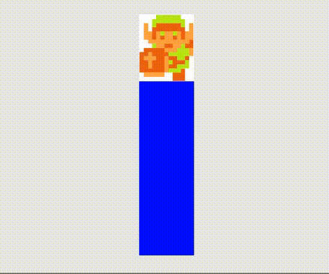
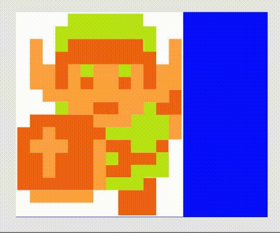
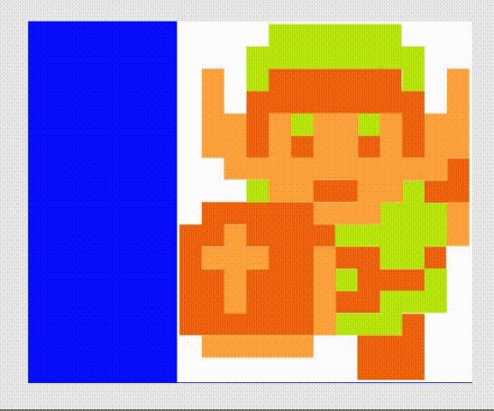
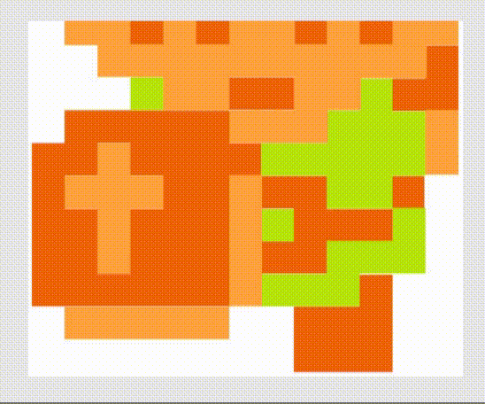
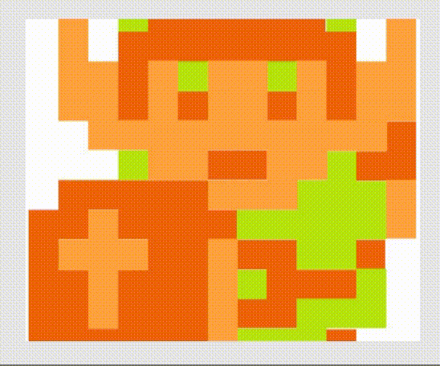
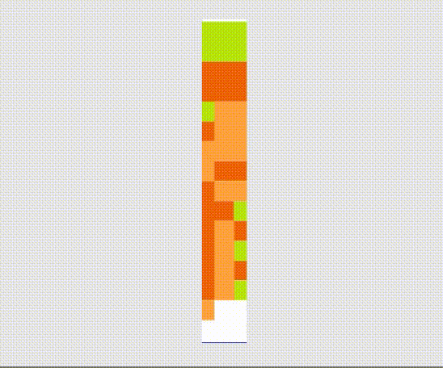

# PXImageView

[](http://cocoapods.org/pods/PXImageView)
[](http://cocoapods.org/pods/PXImageView)
[](http://cocoapods.org/pods/PXImageView)

## Usage

Use it just like a normal `UIImageView`.  The functional difference is the content modes. 

`PXImageView` provides content modes that are likely more useful for you than what apple provides.  It preserves the staples:

* UIViewContentModeScaleAspectFit -> PXContentModeFit
* UIViewContentModeScaleAspectFill -> PXContentModeFill

as well as providing several very useful ones (note in all these images, the blue imageview is resizing, not zooming):


* PXContentModeTop:  
  Scale the image keeping it attached to the top, right, and left edges.
  The bottom edge is free to move up and down as the image and view aspect
  ratios dictate.  
  

* PXContentModeLeft:  
  Scale the image keeping it attached to the left, top, and bottom edges.
  The right edge is free to move sideways as the image and view aspect
  ratios dictate.  
  
 
* PXContentModeRight:  
  Scale the image keeping it attached to the right, top, and bottom edges.
  The left edge is free to move sideways as the image and view aspect
  ratios dictate.  
  

* PXContentModeBottom:  
  Scale the image keeping it attached to the bottom, right, and left edges.
  The top edge is free to move up and down as the image and view aspect
  ratios dictate.  
  

* PXContentModeSides:  
  Scale the image keeping it centered and attached to the right and left edges.
  The top and bottom edges move up and down depending on the image and view
  aspect ratios.  
  

* PXContentModeTopBottom:  
  Scale the image keeping it centered and attached to the top and bottom edges.
  The left and right edges move side to side depending on the image and view
  aspect ratios.  
  


To run the example project and see all these content modes in action, clone the repo, and run `pod install` from the Example directory first.

## Installation

PXImageView is available through [CocoaPods](http://cocoapods.org). To install
it, simply add the following line to your Podfile:

```ruby
pod "PXImageView"
```

## Author

Daniel Blakemore, DanBlakemore@gmail.com

## License

PXImageView is available under the MIT license. See the LICENSE file for more info.
